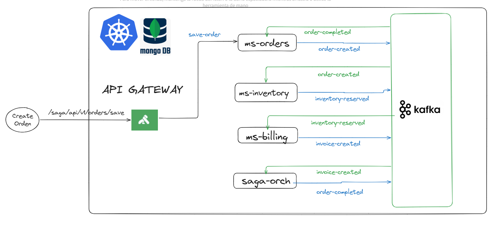

### README

# Ssga Ecommerce (`saga-ecommerce`)

Este proyecto es un sistema de comercio electrónico basado en el patrón **Saga**. 
El microservicio se encarga de generar ordenes para los pedidos realizados, desccuento de inventario,
y la facturación de los mismos.

Si algun proceso del sistema falla realiza una **compensación de las acciones realizadas.**

Está diseñado para ejecutarse en un entorno de contenedores con **Docker** y **Kubernetes**.

## Diagrama de Arquitectura



---

## Características

- **Patrón Saga**: Implementación de un flujo distribuido para garantizar la consistencia en transacciones entre microservicios.
- **Spring Boot**: Framework principal para el desarrollo del microservicio.
- **Kafka**: Sistema de mensajería para la comunicación entre microservicios.
- **MongoDB**: Base de datos NoSQL para almacenar las facturas generadas.
- **Reactor (Programación Reactiva)**: Uso de `Mono` y `Flux` para operaciones asíncronas.
- **Docker y Kubernetes**: Contenerización y orquestación del microservicio.


---

## Tecnologías utilizadas

- **Java 21**
- **Spring Boot 3.5.3**
- **Reactor (Project Reactor)**
- **Maven**: Gestión de dependencias y construcción del proyecto.
- **Docker**: Contenerización del microservicio.
- **Kubernetes**: Orquestación y despliegue en clúster.
- **Helm**: Gestión de paquetes para Kubernetes.
- **Kong**: API Gateway para gestionar las peticiones a los microservicios.
- **Lombok**: Reducción de código repetitivo.
- **Patrón Hexagonal**: Separación de lógica de negocio y adaptadores externos.

---

## Arquitectura

Los microservicios siguen una **Arquitectura Hexagonal** con los siguientes componentes principales:

1. **Capa de Aplicación**:
    - Contiene la lógica de negocio principal, como la generación de facturas.
    - Clase principal: `BillingService`.

2. **Capa de Dominio**:
    - Modelos de dominio como `Invoice`.
    - Puertos para interactuar con adaptadores externos:
        - `InvoiceRepositoryPort`: Interfaz para persistencia de facturas.
        - `EventPublisherPort`: Interfaz para publicar eventos.

3. **Capa de Infraestructura**:
    - Implementaciones de los puertos para interactuar con bases de datos y sistemas de mensajería.

---

## Configuración y Ejecución

### Requisitos previos

- **Java 21** o superior.
- **Docker** 
- **Kubernetes** 

### Construcción del proyecto

1. Clonar el repositorio:
   ```bash
   git clone <URL_DEL_REPOSITORIO>
   cd saga-pattern
   ```

2. Construir el proyecto con Maven:
   ```bash
   mvn clean install -DskipTests
   ```

### Ejecución con Docker

1. Construir las imagenes Docker:
   ```bash
   make build-ms-billing
   make build-ms-orders
   make build-ms-inventory
   ```
2. Enviarlos al registry
   
Depende de en que registry los usas o sino local. Mirar el makefile y configurar segun tus necesidades. 
    ```bash
    make deploy-ms-billing
    make deploy-ms-orders
    make deploy-ms-inventory
    ```

### Despliegue en Kubernetes

Prerequisitos:
- Tener un clúster de Kubernetes configurado.
- Haber instalado **Helm** y **Kong**.

1. Instalar Kong
   ```bash
   helm install kong kong/ingress -n kong --create-namespace
    ```
2. Aplicar el despliegue:
   ```bash
   
   helm install saga-pattern ./saga-pattern --namespace ecommerce --create-namespace
   ```

---

## Uso

### Listar Productos

El microservicio `ms-inventory` expone un endpoint para listar productos disponibles.

### Generación de Ordenes

El microservicio `ms-orders` expone un endpoint para generar ordenes de pedidos.

1. Validar el pedido recibido.
2. Descontar el inventario de los productos.
3. Generar la factura correspondiente.


### Ver Facturas

El microservicio `ms-billing` expone un endpoint para consultar las facturas generadas.

---

## Contribuciones

1. Realizar un fork del repositorio.
2. Crear una rama para los cambios:
   ```bash
   git checkout -b feature/nueva-funcionalidad
   ```
3. Enviar un pull request con los cambios.

---

